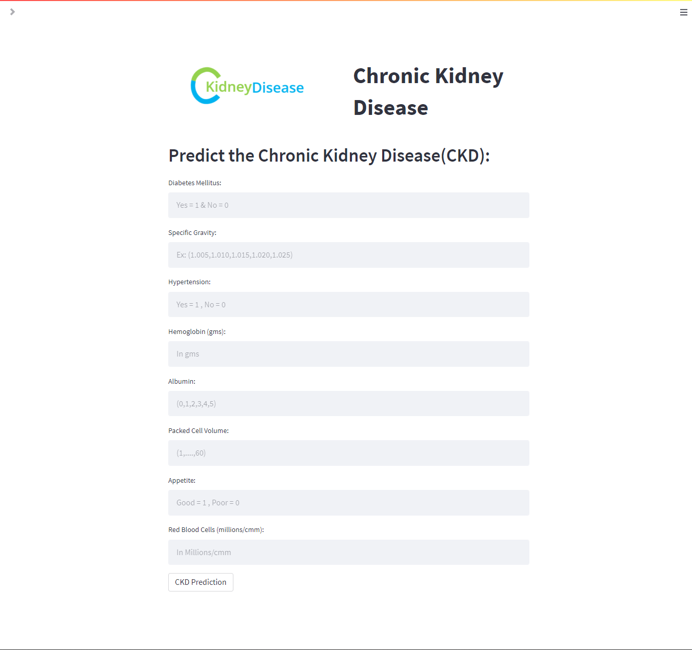

## Chronic Kidney Disease Prediction
>[Website Link](https://tayyab885-chronic-kidney-disease-prediction-app-s4cofm.streamlit.app/)
### Website Preview
#### Home Page:


#### Data cleaning Page:


#### Machine Learning Algorithms Page:


#### Disease Prediction Page:


----

## Installation: 📦
>pip install -r requirements.txt

#### Clone:

- Clone this repo to your local machine.

#### Run app locally:
Open terminal in the directory where app is cloned and run the following command in terminal.
```shell
$ streamlit run app.py
```

## Features 📋
This is a more of story telling app. The user can not only Predict the disease but also can perform some other actions.
* Genrate the report about dataset.
* Clean the dataset.
* Implement different Algorithms and Check Accuracy training those Algorithms.
* Visualize the Data using graphs.
* Predict the Chronic Kidney Disease.

---

## Models
Classification models were tried to check for the best model to predict chronic kidney disease since the prediction of disease.
  - Random Forest Tree
  - Gradient Boosting
  - Artificial Neural Network
 
## Accuracy
- Random Forest gives the accuracy of 98%.
- Gradient Boosting gives the accuracy of 96%.
- Artificial Neural Network gives the accuracy of 89%.
    
    
    
  ---
